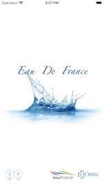
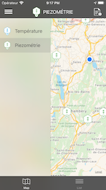
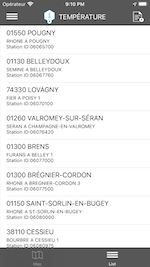
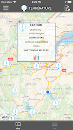
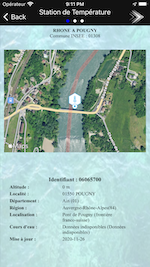
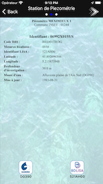
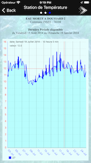
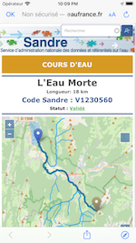
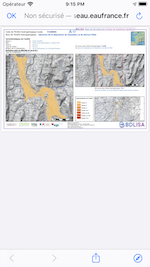
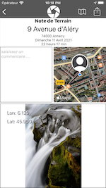

# EauDeFrance
EauDeFrance uses data from Piezometry stations or temperature stations on rivers in the national territory.
The app displays the characteristics of the station and gives the measurement history.

The user can make a geolocated field note and distribute it on social networks with a photo

#### Temperature
     

  

 

### API REST
HubEau.eaufrance.fr ( endpoint Temperature and Piezometry )

### SKILLS
* UIKit
* Swift POO
* MVC
* MapKit
* Network management
* NavigationController, TableView, PageViewController, 
* Unit Test, Singleton Pattern
* Generic class
* Protocol
* SafariService
* XIB 
* camera management

### PODS
* SwiftLint: A tool to enforce Swift style and conventions
* Charts: charts library
* ENSwiftSideMenu: side menu management